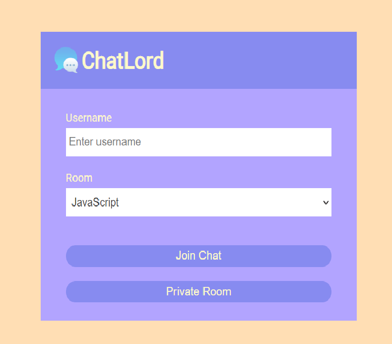
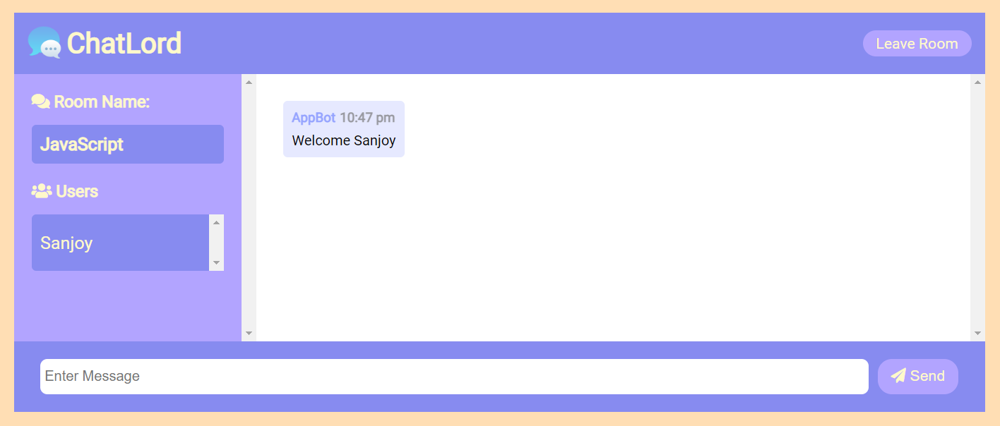
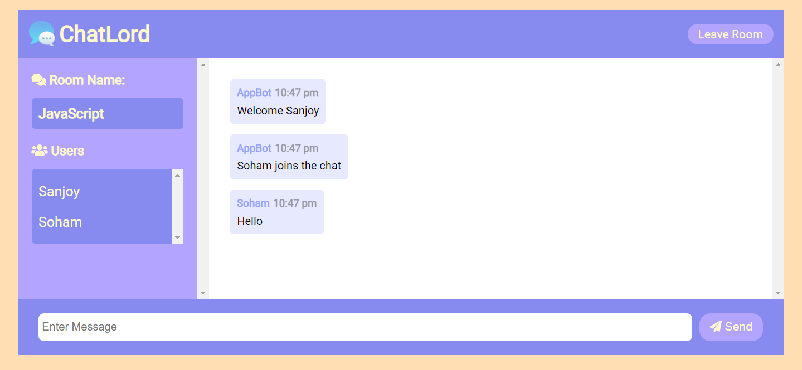
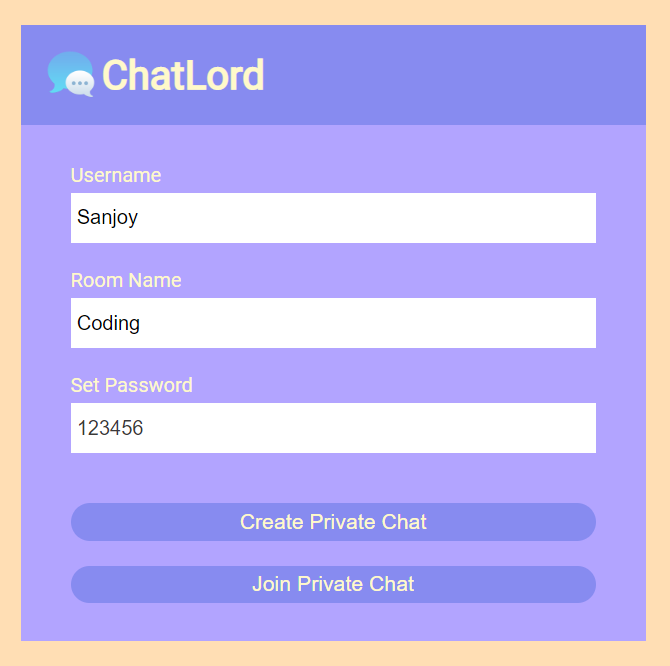
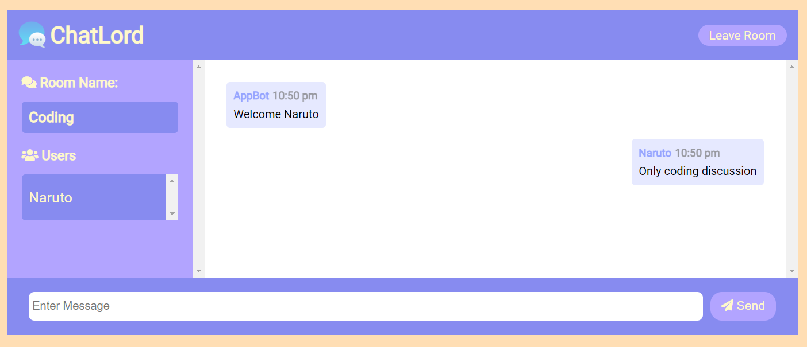

# Welcome to CharLord

This is a **Real-time Live online chatting application** build with **[Node Js](https://nodejs.org/en/docs/)** and **[Socket Io](https://socket.io/docs/v4/)**.

Here you can join any available public chatroom -

  

 

  

 

  

 

Or you can make a private chatroom for your own group -

  

 

  

 

Website Link - [ChatLord](https://live-messaging-app.herokuapp.com/)

